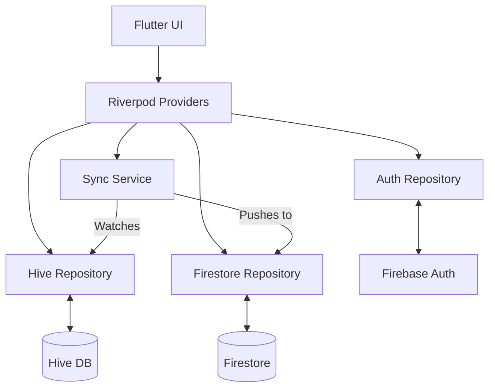
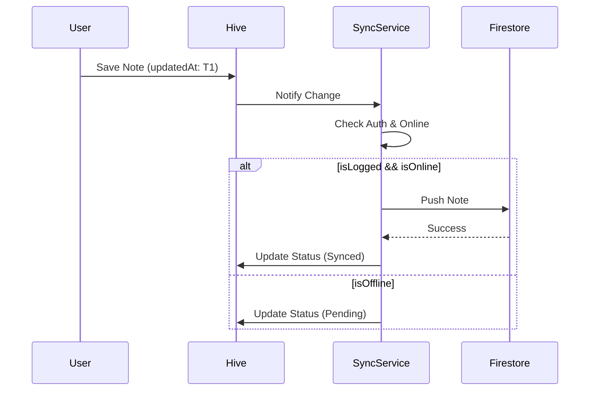

# Inkwell Notes — Design Document

## 1. Overview
Inkwell Notes is a premium, offline-first note-taking application built with Flutter. It focuses on a high-end "editorial" aesthetic, seamless cross-platform performance (PWA + Android), and robust synchronization between local storage (Hive) and cloud storage (Firebase Firestore).

The app serves two primary user states:
1. **Guest (Local Only):** High-speed, private note-taking stored entirely on the device.
2. **Authenticated:** Automatic background synchronization with Firestore, enabling multi-device access.

## 2. Problem Analysis
Modern note-taking apps often sacrifice either speed (by being cloud-dependent) or beauty (by being utility-focused). Inkwell Notes aims to solve the "latency vs. reliability" problem by using a local-first architecture where Hive is the source of truth, and Firestore is a secondary synchronization layer.

### Challenges:
- **Web Storage Constraints:** Web browsers have limited and sometimes transient storage.
- **Rich Text Complexity:** Synchronizing JSON-based Quill Deltas while maintaining formatting across platforms.
- **Conflict Resolution:** Handling edits made on multiple devices while offline.

## 3. Alternatives Considered
| Feature | Alternative | Reason for Rejection |
| :--- | :--- | :--- |
| **State Management** | BLoC | Too much boilerplate for a feature-rich UI that requires high reactivity between many providers. Riverpod is more idiomatic for this project. |
| **Local DB** | SQLite (sqflite) | SQLite is excellent but has more overhead for web (requires `sqflite_common_ffi_web`). Hive is faster for simple JSON-like note structures. |
| **Sync Logic** | Firestore Offline | While Firestore has built-in persistence, it doesn't give fine-grained control over "Local Mode" vs "Cloud Mode" merging as easily as a Hive + Firestore hybrid approach. |

## 4. Detailed Design

### 4.1 Architecture (Riverpod)
The app follows a Layered Architecture:
- **Presentation:** Widgets + Riverpod Providers (Notifiers).
- **Domain:** Models (`NoteModel`, `TagModel`) and Business Logic.
- **Data:** Repositories (HiveRepository, FirestoreRepository, AuthRepository).

### 4.2 Data Flow & Sync Logic
#### The "Source of Truth"
1. **Hive** is always the primary source of truth for the UI.
2. Every change is saved to Hive immediately.
3. If the user is logged in and online, a **SyncNotifier** pushes the change to Firestore.

#### Conflict Resolution
We will use a **Last-Write-Wins (LWW)** strategy based on a `updatedAt` timestamp.
- When syncing, the record with the newer `updatedAt` wins.
- If a note is modified locally while offline, its `syncStatus` is set to `pending`.
- Upon reconnection, `pending` notes are pushed to Firestore.

#### Image Handling
- **Local:** Images are stored as base64 (Web) or File Paths (Android) in the Hive database for instant offline access.
- **Cloud:** To stay within Firestore limits and maintain quality, images will be uploaded to **Firebase Storage**. The Quill Delta will store the Storage URL for synced notes.
- **Compression:** Images will be aggressively compressed (Target < 500KB) before upload.

### 4.3 Database Schema

#### Hive (Local) / Firestore (Remote)
```dart
class NoteModel {
  String id;             // UUID
  String userId;         // Firebase UID or 'local'
  String title;
  String contentJson;    // Quill Delta
  String plainText;      // For search and excerpts
  List<String> tags;
  DateTime createdAt;
  DateTime updatedAt;
  bool isPinned;
  bool isDeleted;        // Soft delete for Undo
  SyncStatus syncStatus; // synced, pending, offline
}
```

### 4.4 UI/UX Design (Editorial Style)
- **Typography:** 
  - Serif: `Merriweather` (Body, Headlines).
  - Sans: `Inter` (UI, Buttons, Labels).
- **Theming:** 
  - Dark Mode: `#0F0F0F` (Background), `#E8D5B7` (Accent).
  - Light Mode: `#FAFAF8` (Background), `#4A3728` (Accent).
- **Navigation:** `go_router` with a `StatefulShellRoute` for the persistent bottom navigation bar.

## 5. Diagrams

### System Architecture


### Note Sync Flow


## 6. PWA & Android Strategy
- **PWA:** Build with `--wasm`. Manifest includes maskable icons and screenshots for "Rich Install" UI.
- **Android:** Custom `AndroidManifest.xml` for permissions (Storage, Internet).
- **Service Worker:** Custom cache strategy for Google Fonts and Firebase SDKs to ensure zero-loading state.

## 7. References
- [Flutter PWA Best Practices 2024](https://flutternest.com/flutter-pwa-guide/)
- [Material 3 Editorial Design](https://m3.material.io/styles/typography/overview)
- [Riverpod Documentation](https://riverpod.dev/)
- [Quill Delta Format](https://quilljs.com/docs/delta/)
